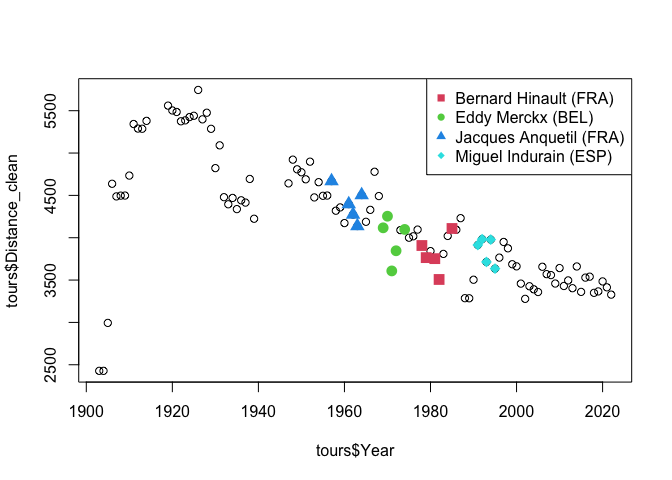

-   [Pushing Further: Interrogating Data with
    Confidence](#pushing-further-interrogating-data-with-confidence)
    -   [What We Discovered Last Time](#what-we-discovered-last-time)
    -   [What We’re Tackling Next](#what-were-tackling-next)
    -   [Where We All Begin: Loading the
        Data](#where-we-all-begin-loading-the-data)
    -   [How Many Riders Won the Tour de France Without Winning Any
        Stage *That
        Year*?](#how-many-riders-won-the-tour-de-france-without-winning-any-stage-that-year)
    -   [Of the Riders Who Have Won the Most Tour de France, Who Rode
        the
        Furthest?](#of-the-riders-who-have-won-the-most-tour-de-france-who-rode-the-furthest)
    -   [Which City Has Been Visited Most
        Often?](#which-city-has-been-visited-most-often)
    -   [Who has finished last the
        most?](#who-has-finished-last-the-most)
-   [Food for thought](#food-for-thought)
-   [What’s Next?](#whats-next)

------------------------------------------------------------------------

This blog along with all the necessary data are available in different
formats (pdf, html, Rmd, and md) on [DataSharp’s
GitHub](https://github.com/DataSharpAcademy/blog/tree/360dcc5968780d69b254406abe9e15323f6a34be/2025_07_22_Tour-de-France).

------------------------------------------------------------------------

## Pushing Further: Interrogating Data with Confidence

In [our last
post](https://datasharpacademy.com/tour-de-france-meets-data-science-a-beginners-case-study/),
we practiced loading real-world data, asking simple questions, and
dealing with the inevitable quirks of messy datasets.

Today, we’re taking things further.

We will use the same **Tour de France dataset** to tackle *more complex,
layered questions*. These will require you to think critically, combine
columns, process text, and validate your assumptions carefully.

This post will show you how to:

-   **Transform messy columns** into clean, usable numbers.
-   **Extract structured information** from unstructured text.
-   **Combine multiple tables** to uncover richer insights.
-   **Answer questions that span multiple datasets** with clarity and
    confidence.

If you’re ready to move from “basic data handling” to “practical
analysis that actually answers questions,” this post is for you.

### What We Discovered Last Time

In our first exploration of the Tour de France dataset, we uncovered
some surprising insights despite asking seemingly simple questions:

-   🏆 Only **65 different riders** have won the Tour de France.
-   🚴 In contrast, **917 different riders or teams** have won at least
    one Tour de France stage.
-   🧐 **Three riders** managed to win the Tour de France *without ever
    winning a single stage* in their career.

These findings highlighted how even basic data questions can reveal
inconsistencies, typos, and quirks in real-world datasets, requiring us
to clean and check our data along the way.

### What We’re Tackling Next

In this post, we’re levelling up.

We will explore more complex questions such as:

-   How many riders won the Tour de France without winning a stage *in
    that year*?
-   Of the riders who won the most Tours, who won with the longest total
    race time?
-   Which city has been visited the most in Tour history?
-   Who has finished last the most times?

These questions will stretch our data skills further, as we will:

    ❶ Combine information across multiple columns and tables.
    ❷ Practise data cleaning to prepare our data for robust analysis.

Ready? Let’s dive in.

### Where We All Begin: Loading the Data

If you’ve been following along, you’re already familiar with the
structure of our Tour de France dataset and how to load it into R. If
not, check out the previous post for a step-by-step walkthrough.

For this analysis, we will once again load our three tables:

    finishers <- read.csv('./data/tdf_finishers.csv')
    stages <- read.csv('./data/tdf_stages.csv')
    tours <- readr::read_csv('./data/tdf_tours.csv', locale=readr::locale(encoding="UTF-8"))

    ## Rows: 109 Columns: 6
    ## ── Column specification ─────────────────────────────────────────────────────────────────────────────────
    ## Delimiter: ","
    ## chr (3): Dates, Stages, Distance
    ## dbl (3): Year, Starters, Finishers
    ## 
    ## ℹ Use `spec()` to retrieve the full column specification for this data.
    ## ℹ Specify the column types or set `show_col_types = FALSE` to quiet this message.

### How Many Riders Won the Tour de France Without Winning Any Stage *That Year*?

This question builds on the previous post, adding a new twist: **Did the
winner also win a stage during that specific Tour?**

It’s a subtle but important distinction that requires us to **check, for
each edition**, whether the overall winner claimed any stage victories
that year.

**Why this matters?** In real-world analysis, refining your question
often changes your approach completely. Here, we move from a simple list
comparison to a task requiring **merging datasets** to align detailed
records across tables.

#### Merging Datasets in Practice

To tackle this, we’ll merge our `finishers` and `stages` tables using
`Year` as the key:

-   `finishers` contains one row per rider per Tour (with their final
    rank).
-   `stages` contains one row per stage per Tour (with the stage
    winner).

Since both share `Year`, we can merge them using `merge()`. In our case,
since the `Year` columns in both tables have the exact same set of
values, we can perform a simple join without overthinking it. However,
if this wasn’t the case, we would need to decide between:

-   `left_join` (keep all rows from the left table),
-   `right_join` (keep all rows from the right table),
-   `inner_join` (keep only rows present in both),
-   and a few other options.

I won’t cover these advanced joins here, but stay tuned for a future
post where we’ll tackle these in a clear, practical way. In our case,
all these joins would produce the same result.

#### Cleaning The Data Before Merging

Before merging, we need to ensure consistency in names across tables. In
the previous post, we found some name differences:

-   `"Maurice De Waele (BEL)"` vs `"Maurice Dewaele (BEL)"`
-   `"Chris Froome (GBR)"` vs `"Chris Froome (UK)"`

To avoid unnenessary complications below, I wanted to fix these problems
first. Unfortunately, I immediately encountered a new problem. See for
yourself:

    head(finishers[finishers$Year==2013, ])

    ##      Year Rank                   Rider        Time               Team
    ## 8340 2013    1       Chris Froome (UK) 83h 56' 40"           Team Sky
    ## 8341 2013    2    Nairo Quintana (COL)    + 4' 20"      Movistar Team
    ## 8342 2013    3 Joaquim Rodríguez (ESP)    + 5' 04"       Team Katusha
    ## 8343 2013    4  Alberto Contador (ESP)    + 6' 27"       Saxo–Tinkoff
    ## 8344 2013    5   Roman Kreuziger (CZE)    + 7' 27"       Saxo–Tinkoff
    ## 8345 2013    6     Bauke Mollema (NED)   + 11' 42" Belkin Pro Cycling

    finishers[finishers$Rider == "Chris Froome (UK)", ]

    ## [1] Year  Rank  Rider Time  Team 
    ## <0 rows> (or 0-length row.names)

\`We can see there is at least one entry for “Chris Froome (UK)” in the
table. However, when I try to capture it with a boolean expression,
nothing appears? Why is that now?

The root cause is really difficult to identify.

It took me some time, but I eventually found an unsual character,
**hidden non-ASCII characters**, that looks like a space but is not a
space – if you look at the table above carefully, you’ll notive the two
“spaces” do not have the same width. That’s what causes the mismatches
between the strngs. But how can we see these more clearly?

Since I had no idea how to do that in R (I actually used Python to load
the data and show the non-ASCII characers), I had to Google it for this
post. Here is the solution I found. It is not perfect, but it does the
job:

    tools::showNonASCII(head(finishers[finishers$Year==2013, 'Rider']))

    ## 1: Chris Froome<c2><a0>(UK)
    ## 2: Nairo Quintana<c2><a0>(COL)
    ## 3: Joaquim Rodr<c3><ad>guez<c2><a0>(ESP)
    ## 4: Alberto Contador<c2><a0>(ESP)
    ## 5: Roman Kreuziger<c2><a0>(CZE)
    ## 6: Bauke Mollema<c2><a0>(NED)

We can now clearly see that the space between the first and last name is
a proper space, while the “space” between the name and the country code
is not! Since the odds of findings more non-ASCII characters elsewhere
in the table are high, the simplest solution for us to move forward with
our analysis is to batch-replace all the non-ASCII characters by a
similar ASCII characters (*e.g.* é by e, ù by u, etc.)

Naturally, there is a function that does it for us. To clean up, we
convert all characters to ASCII using:

    finishers$Rider <- stringi::stri_trans_general(finishers$Rider, "latin-ascii")
    stages$Winner <- stringi::stri_trans_general(stages$Winner, "latin-ascii")

We can check the names are now looking correct.

    tools::showNonASCII(head(finishers[finishers$Year==2013, 'Rider']))

Nothing is shown, meaning there are no fields with non-ASCII characters
anymore. Yay!

And if we try our first test again, we now get a match:

    finishers[finishers$Rider == "Chris Froome (UK)", ]

    ##      Year Rank             Rider        Time     Team
    ## 8340 2013    1 Chris Froome (UK) 83h 56' 40" Team Sky

Once confirmed clean, we fix remaining name inconsistencies:

    finishers[finishers$Rider == "Chris Froome (UK)", 'Rider'] <- "Chris Froome (GBR)"
    stages[stages$Winner == 'Maurice Dewaele (BEL)', 'Winner'] <- 'Maurice De Waele (BEL)'

And, as good practice habit, we check that the data were really
modified.

    finishers[finishers$Rider == "Chris Froome (UK)", ]

    ## [1] Year  Rank  Rider Time  Team 
    ## <0 rows> (or 0-length row.names)

📝 **Note**: Since I modified the Rider `columns` from `finishers`, I
also add to modify the `Winner` column from `stages` to ensure that the
pairings would still be there.

#### Back to the question

Now we have clean data for our question, we can move on to merging our
tables.

Since merged datasets can become *very large*, it is always wise to
consider whether you can **filter your tables before merging**. In our
case, we don’t need the entire `finishers` table but only the rows
corresponding to the winners of each edition.

We will therefore create a `finishers_onlywinners` table containing only
the riders who finished **ranked 1** in each Tour de France:

    finishers_onlywinners <- finishers[finishers$Rank ==1, ]
    stage_finish <- merge(stages, finishers_onlywinners, by='Year')
    tail(stage_finish, n=10)

    ##      Year       Date Stage                                           Course
    ## 2227 2022 2022-07-14    12                          Briançon to Alpe d'Huez
    ## 2228 2022 2022-07-15    13               Le Bourg-d'Oisans to Saint-Étienne
    ## 2229 2022 2022-07-16    14                           Saint-Étienne to Mende
    ## 2230 2022 2022-07-17    15                             Rodez to Carcassonne
    ## 2231 2022 2022-07-19    16                              Carcassonne to Foix
    ## 2232 2022 2022-07-20    17                      Saint-Gaudens to Peyragudes
    ## 2233 2022 2022-07-21    18                              Lourdes to Hautacam
    ## 2234 2022 2022-07-22    19                      Castelnau-Magnoac to Cahors
    ## 2235 2022 2022-07-23    20                  Lacapelle-Marival to Rocamadour
    ## 2236 2022 2022-07-24    21 Paris La Défense Arena to Paris (Champs-Élysées)
    ##                 Distance                  Type                   Winner Rank
    ## 2227 165.5 km (102.8 mi)        Mountain stage        Tom Pidcock (GBR)    1
    ## 2228     193 km (120 mi)            Flat stage      Mads Pedersen (DEN)    1
    ## 2229 192.5 km (119.6 mi) Medium-mountain stage   Michael Matthews (AUS)    1
    ## 2230 202.5 km (125.8 mi)            Flat stage   Jasper Philipsen (BEL)    1
    ## 2231 178.5 km (110.9 mi)        Mountain stage         Hugo Houle (CAN)    1
    ## 2232      130 km (81 mi)        Mountain stage      Tadej Pogacar (SLO)    1
    ## 2233  143.5 km (89.2 mi)        Mountain stage   Jonas Vingegaard (DEN)    1
    ## 2234 188.5 km (117.1 mi)            Flat stage Christophe Laporte (FRA)    1
    ## 2235   40.7 km (25.3 mi) Individual time trial      Wout van Aert (BEL)    1
    ## 2236      116 km (72 mi)            Flat stage   Jasper Philipsen (BEL)    1
    ##                       Rider        Time             Team
    ## 2227 Jonas Vingegaard (DEN) 79h 33' 20" Team Jumbo–Visma
    ## 2228 Jonas Vingegaard (DEN) 79h 33' 20" Team Jumbo–Visma
    ## 2229 Jonas Vingegaard (DEN) 79h 33' 20" Team Jumbo–Visma
    ## 2230 Jonas Vingegaard (DEN) 79h 33' 20" Team Jumbo–Visma
    ## 2231 Jonas Vingegaard (DEN) 79h 33' 20" Team Jumbo–Visma
    ## 2232 Jonas Vingegaard (DEN) 79h 33' 20" Team Jumbo–Visma
    ## 2233 Jonas Vingegaard (DEN) 79h 33' 20" Team Jumbo–Visma
    ## 2234 Jonas Vingegaard (DEN) 79h 33' 20" Team Jumbo–Visma
    ## 2235 Jonas Vingegaard (DEN) 79h 33' 20" Team Jumbo–Visma
    ## 2236 Jonas Vingegaard (DEN) 79h 33' 20" Team Jumbo–Visma

    dim(stage_finish)

    ## [1] 2236   11

We can see that the new merged table is *much larger*. Since there are
many stages in each Tour de France, the `stages` table contained
multiple rows per year, while `finishers_onlywinners` had only **one row
per year**. During the merge, the information from
`finishers_onlywinners` was duplicated as many times as necessary to
align with each corresponding stage in `stages`.

Thanks to this merge, **each row now displays both the stage winner and
the corresponding Tour de France winner for that year**. Now to address
our question, we need to identify all the editions where there is no
match between these two columns.

However, this can be difficult to code. But identifying the Tour de
France winners that won a stage that year is more direct. All we need to
do now is check, for each row, whether these two columns are equal,
*i.e.*, whether the overall winner also won a stage during that edition.

We can use the `==` operator directly between the two columns of
interest to generate a boolean vector identifying which rows meet this
condition, and then subset the data frame using that boolean vector to
isolate the cases where the Tour winner won at least one stage:

    win_stage_and_tour <- stage_finish$Winner == stage_finish$Rider
    head(stage_finish[win_stage_and_tour, c('Year', 'Winner', "Rider")], n=10)

    ##    Year                  Winner                   Rider
    ## 3  1903     Maurice Garin (FRA)     Maurice Garin (FRA)
    ## 4  1903     Maurice Garin (FRA)     Maurice Garin (FRA)
    ## 6  1903     Maurice Garin (FRA)     Maurice Garin (FRA)
    ## 14 1905 Louis Trousselier (FRA) Louis Trousselier (FRA)
    ## 15 1905 Louis Trousselier (FRA) Louis Trousselier (FRA)
    ## 17 1905 Louis Trousselier (FRA) Louis Trousselier (FRA)
    ## 20 1905 Louis Trousselier (FRA) Louis Trousselier (FRA)
    ## 22 1905 Louis Trousselier (FRA) Louis Trousselier (FRA)
    ## 28 1906      Rene Pottier (FRA)      Rene Pottier (FRA)
    ## 29 1906      Rene Pottier (FRA)      Rene Pottier (FRA)

    dim(stage_finish[win_stage_and_tour, c('Year', 'Winner', "Rider")])

    ## [1] 281   3

Wow, we can see that it is actually quite common for the overall winner
to also win at least one stage during the same Tour, which is not too
surprising. Winning a stage is the best way to create a significant gap
with your opponents.

But now comes the real question:

**How many riders didn’t win any stages during the year they won the
Tour?**

To answer this, we need to identify the list of all the Tours since 1903
and remove from it those where the final winners also won a stage.

    # Riders who won the Tour AND won at least one stage that year
    number_of_tours <- length(unique(tours$Year))
    number_of_tours

    ## [1] 109

While the Tour is an annual event, 11 events have been cancelled between
1903 and 2022 (during the two World Wars).

    # Riders who won the Tour WITHOUT winning a stage that year
    tour_winner_with_stage <- unique(stage_finish[win_stage_and_tour, c('Year', 'Winner', "Rider")])
    dim(tour_winner_with_stage)

    ## [1] 95  3

There were 14 editions where the winner did not win any stage.

**How can we identify these editions?**

We know the years of the Tours when the final winner won a stage. We can
use `setdiff()` again to find these years where he did not.

    years_no_stages <- setdiff(tours$Year, tour_winner_with_stage$Year)
    years_no_stages

    ##  [1] 1904 1922 1956 1960 1966 1990 2001 2002 2003 2004 2005 2006 2017 2019

Due to huge doping scandals, no victor was assigned to the Tours 2001 to
2005. But what happened to the other ones?

    winners_no_stage <- unique(stage_finish[stage_finish$Year %in% years_no_stages, c('Year', "Rider")])
    winners_no_stage

    ##      Year                 Rider
    ## 7    1904    Henri Cornet (FRA)
    ## 199  1922   Firmin Lambot (BEL)
    ## 804  1956 Roger Walkowiak (FRA)
    ## 897  1960 Gastone Nencini (ITA)
    ## 1037 1966    Lucien Aimar (FRA)
    ## 1641 1990     Greg LeMond (USA)
    ## 1880 2006   Oscar Pereiro (ESP)
    ## 2111 2017    Chris Froome (GBR)
    ## 2153 2019     Egan Bernal (COL)

In this list of 9 winners, we recognised the names of the three riders
we previously identified as Tour winners without stages (Henri Cornet,
Roger Walkowiak, and Egan Bernal). We can therefore visually inspect our
data for the remaining six riders:

    for(y in 1:nrow(winners_no_stage)) {
        if(! winners_no_stage[y, 'Rider'] %in% c("Henri Cornet (FRA)", 'Roger Walkowiak (FRA)', 'Egan Bernal (COL)')){
            print(paste("Winner name", winners_no_stage[y, 'Rider'], sep=": "))
            print(unique(stage_finish[stage_finish$Year == winners_no_stage[y, 'Year'], ]$Winner))
            print(noquote(""))
        }
    }

    ## [1] "Winner name: Firmin Lambot (BEL)"
    ## [1] "Philippe Thys (BEL)"    "Romain Bellenger (FRA)" "Robert Jacquinot (FRA)"
    ## [4] "Jean Alavoine (FRA)"    "Federico Gay (ITA)"     "Felix Sellier (BEL)"   
    ## [7] "Emile Masson (BEL)}"    "Emile Masson (BEL)"    
    ## [1] 
    ## [1] "Winner name: Gastone Nencini (ITA)"
    ##  [1] "Jean Graczyk (FRA)"         "Julien Schepens (BEL)"     
    ##  [3] "Roger Riviere (FRA)"        "Rene Privat (FRA)"         
    ##  [5] "Nino Defilippis (ITA)"      "Andre Darrigade (FRA)"     
    ##  [7] "Graziano Battistini (ITA)"  "Martin van Geneugden (BEL)"
    ##  [9] "Kurt Gimmi (SUI)"           "Michel Van Aerde (BEL)"    
    ## [11] "Louis Proost (BEL)"         "Fernando Manzaneque (ESP)" 
    ## [13] "Rolf Graf (SUI)"            "Pierre Beuffeuil (FRA)"    
    ## [1] 
    ## [1] "Winner name: Lucien Aimar (FRA)"
    ##  [1] "Edy Schutz (LUX)"              "Ferdinand Bracke (BEL)"       
    ##  [3] "Franco Bitossi (ITA)"          "Rudi Altig (FRG)"             
    ##  [5] "Guido Reybrouck (BEL)"         "Televizier-Batavus"           
    ##  [7] "Gerben Karstens (NED)"         "Willy Planckaert (BEL)"       
    ##  [9] "Edward Sels (BEL)"             "Henk Nijdam (NED)"            
    ## [11] "Pierre Beuffeuil (FRA)"        "Guido Marcello Mugnaini (ITA)"
    ## [13] "Georges Vandenberghe (BEL)"    "Jo de Roo (NED)"              
    ## [15] "Raymond Poulidor (FRA)"        "Luis Otano (ESP)"             
    ## [17] "Julio Jimenez (ESP)"           "Tommaso de Pra (ITA)"         
    ## [19] "Albert Van Vlierberghe (BEL)" 
    ## [1] 
    ## [1] "Winner name: Greg LeMond (USA)"
    ##  [1] "Massimo Ghirotto (ITA)"    "Johan Museeuw (BEL)"      
    ##  [3] "Olaf Ludwig (GDR)"         "Thierry Marie (FRA)"      
    ##  [5] "Frans Maassen (NED)"       "Panasonic-Sportlife"      
    ##  [7] "Moreno Argentin (ITA)"     "Gerrit Solleveld (NED)"   
    ##  [9] "Jelle Nijdam (NED)"        "Raul Alcala (MEX)"        
    ## [11] "Erik Breukink (NED)"       "Eduardo Chozas (ESP)"     
    ## [13] "Thierry Claveyrolat (FRA)" "Gianni Bugno (ITA)"       
    ## [15] "Miguel Indurain (ESP)"     "Dimitri Konychev (URS)"   
    ## [17] "Marino Lejarreta (ESP)"    "Charly Mottet (FRA)"      
    ## [19] "Guido Bontempi (ITA)"     
    ## [1] 
    ## [1] "Winner name: Oscar Pereiro (ESP)"
    ##  [1] "Thor Hushovd (NOR)"        "Jimmy Casper (FRA)"       
    ##  [3] "Robbie McEwen (AUS)"       "Matthias Kessler (GER)"   
    ##  [5] "Oscar Freire (ESP)"        "Serhiy Honchar (UKR)"     
    ##  [7] "Sylvain Calzati (FRA)"     "Juan Miguel Mercado (ESP)"
    ##  [9] "Denis Menchov (RUS)"       "Yaroslav Popovych (UKR)"  
    ## [11] "Jens Voigt (GER)"          "Pierrick Fedrigo (FRA)"   
    ## [13] "Frank Schleck (LUX)"       "Michael Rasmussen (DEN)"  
    ## [15] "Carlos Sastre (ESP)"       "Matteo Tosatto (ITA)"     
    ## [1] 
    ## [1] "Winner name: Chris Froome (GBR)"
    ##  [1] "Geraint Thomas (GBR)"       "Marcel Kittel (GER)"       
    ##  [3] "Peter Sagan (SVK)"          "Arnaud Demare (FRA)"       
    ##  [5] "Fabio Aru (ITA)"            "Lilian Calmejane (FRA)"    
    ##  [7] "Rigoberto Uran (COL)"       "Romain Bardet (FRA)"       
    ##  [9] "Warren Barguil (FRA)"       "Michael Matthews (AUS)"    
    ## [11] "Bauke Mollema (NED)"        "Primoz Roglic (SLO)"       
    ## [13] "Edvald Boasson Hagen (NOR)" "Maciej Bodnar (POL)"       
    ## [15] "Dylan Groenewegen (NED)"   
    ## [1]

📝 **Note**: There are prettier way to do such checks. But I used dirty
code to show that it is not always necessary to look for the pretty
solution, especially when doing some internal checks. If you’re asked
some insights from datasets, nobody will care how you got there. The
results you found and the confidence you have in them is what matters.
So when in doubt, write a quick and dirty check to make sure the data
support your results.

Thanks to Q3, we know the other spelling of these names and we can see
that Chris Froom won stages 8, 15, and 17 in 2013, and Maurice de Waele
won stage 20 in 1929.

> 🚴‍♂️ We can conclude that **9 riders won the Tour de France without
> winning a single stage in the year they won.**

### Of the Riders Who Have Won the Most Tour de France, Who Rode the Furthest?

A handful of cyclists share the record for the most Tour de France wins.
But among them — who had to ride the furthest to achieve those
victories?

Let’s say the record was 8 wins (it’s not — but imagine it was). I’d
like to know which rider covered the most kilometres *across their
winning editions*. That’s our challenge.

To tackle this, we’ll break the problem into manageable parts:

1.  Identify how many wins is the current maximum.
2.  Retrieve the list of riders with that number of wins.
3.  Use the `tours` table to get the distance of each edition.
4.  Sum the distances for each winning rider.

#### Step 1: Find the Max Number of Tour Wins

We start by identifying how many times the most decorated riders have
won the Tour.

    max_wins <- max(table(finishers[finishers$Rank ==1, "Rider"]))
    paste("The maximum number of Tour victories is", max_wins)

    ## [1] "The maximum number of Tour victories is 5"

    max_winners <- table(finishers[finishers$Rank == 1, "Rider"])
    max_winners <- max_winners[max_winners == max_wins]
    names(max_winners)

    ## [1] "Bernard Hinault (FRA)"  "Eddy Merckx (BEL)"      "Jacques Anquetil (FRA)"
    ## [4] "Miguel Indurain (ESP)"

➡️ 4 riders share the record for most Tour de France wins. But who among
them had to pedal the furthest?

#### Step 2: Clean the Distance Column

The `tours` table contains the total distance for each edition, but the
formatting isn’t quite ready for analysis.

Let’s peek at the data:

    head(tours)

    ## # A tibble: 6 × 6
    ##    Year Dates                        Stages Distance          Starters Finishers
    ##   <dbl> <chr>                        <chr>  <chr>                <dbl>     <dbl>
    ## 1  1903 "1\x9619 July 1903"          6      "2,428\xa0km (1,…       60        21
    ## 2  1904 "2\x9624 July 1904"          6      "2,428\xa0km (1,…       88        15
    ## 3  1905 "9\x9630 July 1905"          11     "2,994\xa0km (1,…       60        24
    ## 4  1906 "4\x9629 July 1906"          13     "4,637\xa0km (2,…       82        14
    ## 5  1907 "8 July \x96 4 August 1907"  14     "4,488\xa0km (2,…       93        33
    ## 6  1908 "13 July \x96 9 August 1908" 14     "4,497\xa0km (2,…      112        36

You’ll notice unusual characters in the `Distance` and `Dates` columns.
We’ve seen this before — it’s time to standardise data again.

    finishers_onlywinners <- finishers[finishers$Rank ==1, ]
    stage_finish <- merge(stages, finishers_onlywinners, by='Year')
    tail(stage_finish, n=10)

    ##      Year       Date Stage                                           Course
    ## 2227 2022 2022-07-14    12                          Briançon to Alpe d'Huez
    ## 2228 2022 2022-07-15    13               Le Bourg-d'Oisans to Saint-Étienne
    ## 2229 2022 2022-07-16    14                           Saint-Étienne to Mende
    ## 2230 2022 2022-07-17    15                             Rodez to Carcassonne
    ## 2231 2022 2022-07-19    16                              Carcassonne to Foix
    ## 2232 2022 2022-07-20    17                      Saint-Gaudens to Peyragudes
    ## 2233 2022 2022-07-21    18                              Lourdes to Hautacam
    ## 2234 2022 2022-07-22    19                      Castelnau-Magnoac to Cahors
    ## 2235 2022 2022-07-23    20                  Lacapelle-Marival to Rocamadour
    ## 2236 2022 2022-07-24    21 Paris La Défense Arena to Paris (Champs-Élysées)
    ##                 Distance                  Type                   Winner Rank
    ## 2227 165.5 km (102.8 mi)        Mountain stage        Tom Pidcock (GBR)    1
    ## 2228     193 km (120 mi)            Flat stage      Mads Pedersen (DEN)    1
    ## 2229 192.5 km (119.6 mi) Medium-mountain stage   Michael Matthews (AUS)    1
    ## 2230 202.5 km (125.8 mi)            Flat stage   Jasper Philipsen (BEL)    1
    ## 2231 178.5 km (110.9 mi)        Mountain stage         Hugo Houle (CAN)    1
    ## 2232      130 km (81 mi)        Mountain stage      Tadej Pogacar (SLO)    1
    ## 2233  143.5 km (89.2 mi)        Mountain stage   Jonas Vingegaard (DEN)    1
    ## 2234 188.5 km (117.1 mi)            Flat stage Christophe Laporte (FRA)    1
    ## 2235   40.7 km (25.3 mi) Individual time trial      Wout van Aert (BEL)    1
    ## 2236      116 km (72 mi)            Flat stage   Jasper Philipsen (BEL)    1
    ##                       Rider        Time             Team
    ## 2227 Jonas Vingegaard (DEN) 79h 33' 20" Team Jumbo–Visma
    ## 2228 Jonas Vingegaard (DEN) 79h 33' 20" Team Jumbo–Visma
    ## 2229 Jonas Vingegaard (DEN) 79h 33' 20" Team Jumbo–Visma
    ## 2230 Jonas Vingegaard (DEN) 79h 33' 20" Team Jumbo–Visma
    ## 2231 Jonas Vingegaard (DEN) 79h 33' 20" Team Jumbo–Visma
    ## 2232 Jonas Vingegaard (DEN) 79h 33' 20" Team Jumbo–Visma
    ## 2233 Jonas Vingegaard (DEN) 79h 33' 20" Team Jumbo–Visma
    ## 2234 Jonas Vingegaard (DEN) 79h 33' 20" Team Jumbo–Visma
    ## 2235 Jonas Vingegaard (DEN) 79h 33' 20" Team Jumbo–Visma
    ## 2236 Jonas Vingegaard (DEN) 79h 33' 20" Team Jumbo–Visma

    dim(stage_finish)

    ## [1] 2236   11

    tours$Distance <- stringi::stri_trans_general(tours$Distance, "latin-ascii")
    tours$Dates <- stringi::stri_trans_general(tours$Dates, "latin-ascii")
    head(tours)

    ## # A tibble: 6 × 6
    ##    Year Dates                   Stages Distance            Starters Finishers
    ##   <dbl> <chr>                   <chr>  <chr>                  <dbl>     <dbl>
    ## 1  1903 1�19 July 1903          6      2,428�km (1,509�mi)       60        21
    ## 2  1904 2�24 July 1904          6      2,428�km (1,509�mi)       88        15
    ## 3  1905 9�30 July 1905          11     2,994�km (1,860�mi)       60        24
    ## 4  1906 4�29 July 1906          13     4,637�km (2,881�mi)       82        14
    ## 5  1907 8 July � 4 August 1907  14     4,488�km (2,789�mi)       93        33
    ## 6  1908 13 July � 9 August 1908 14     4,497�km (2,794�mi)      112        36

#### Step 3: Extract Numeric Distance (Cleanly)

The `Distance` column contains entries like `"3,414.4 km (1,121.6 mi)"`.
We want to extract only the first number (in km), and we want to do it
*robustly*.

While we could grab the first 5 characters using
`substr(str, start=1, end=5)` and then use `gsub(',', '', str)` to
remove commas, that would fail if the distance includes decimals — which
it sometimes does. We cannot use a fixed number of characters to extract
the distance.

    tail(tours)

    ## # A tibble: 6 × 6
    ##    Year Dates                            Stages Distance      Starters Finishers
    ##   <dbl> <chr>                            <chr>  <chr>            <dbl>     <dbl>
    ## 1  2017 1�23 July 2017                   21     3,540�km (2,…      198       167
    ## 2  2018 7�29 July 2018                   21     3,349�km (2,…      176       145
    ## 3  2019 6�28 July 2019                   21     3,366�km (2,…      176       155
    ## 4  2020 29 August � 20 September 2020[1] 21     3,484�km (2,…      176       146
    ## 5  2021 26 June � 18 July 2021           21     3,414.4�km (…      184       141
    ## 6  2022 1�24 July 2022                   21     3,328�km (2,…      176       135

You can see that the Tour 2024 was 3414.4 km long. Are these extra 400m
likely to change the global solution to the problem at hand. Probably
not. So in many cases, this solution would work. But I want to give you
a solution that works in *every* situations.

Again it uses `gsub()`, which is the go-to function to replace some
characters by others in a string. But instead of replacing specific
characters, we will use pattern matching using what is called **regular
expressions**. Writing regular expressions is extremely complex and I
usually use either Google or AI to get the pattern that I want.

Here, we want to transform “3,414.4�km (1,121.6�mi)” into a usable
distance. All we want to keep is “3414.4”. We can start by splitting
each line using “km” as delineator and keeping the first part.

    tours$Distance_clean <- stringr::str_split(tours$Distance, 'km', simplify=TRUE)[, 1]
    head(tours$Distance_clean)

    ## [1] "2,428�" "2,428�" "2,994�" "4,637�" "4,488�" "4,497�"

Then we need to tell it to get rid of everything that is not a number or
a dot. We can use this regular expression: \[[1]\\\]

We can use the following regular expression: “\[[2]\[:blank:\]?&/\\\]”,
which means remo This grammar means: remove everything but: \[:alnum:\]
Alphanumeric characters: 0-9 a-Z \\ the dot ‘.’

    tours$Distance_clean <- as.numeric(gsub("[^^[:alnum:]\\.]", "", tours$Distance_clean))
    tail(tours$Distance_clean)

    ## [1] 3540.0 3349.0 3366.0 3484.0 3414.4 3328.0

Then, we only have to merge the tours and stage\_finish table, the
latter limited to the 4 riders who won 5 Tours. For reading purposes, we
also sort the table using the `order(, decreasing=TRUE)` function to get
the longest Tours at the top

    all_dtst <- merge(stage_finish[stage_finish$Rider %in% names(max_winners), ], tours, by='Year')
    all_dtst <- unique(all_dtst[, c('Year', 'Rider', 'Distance_clean')])
    all_dtst[order(all_dtst[, 'Distance_clean'], decreasing=TRUE), ]

    ##     Year                  Rider Distance_clean
    ## 1   1957 Jacques Anquetil (FRA)           4669
    ## 94  1964 Jacques Anquetil (FRA)           4504
    ## 25  1961 Jacques Anquetil (FRA)           4397
    ## 47  1962 Jacques Anquetil (FRA)           4274
    ## 145 1970      Eddy Merckx (BEL)           4254
    ## 71  1963 Jacques Anquetil (FRA)           4138
    ## 119 1969      Eddy Merckx (BEL)           4117
    ## 349 1985  Bernard Hinault (FRA)           4109
    ## 224 1974      Eddy Merckx (BEL)           4098
    ## 396 1992  Miguel Indurain (ESP)           3983
    ## 439 1994  Miguel Indurain (ESP)           3978
    ## 373 1991  Miguel Indurain (ESP)           3914
    ## 251 1978  Bernard Hinault (FRA)           3908
    ## 199 1972      Eddy Merckx (BEL)           3846
    ## 276 1979  Bernard Hinault (FRA)           3765
    ## 301 1981  Bernard Hinault (FRA)           3753
    ## 418 1993  Miguel Indurain (ESP)           3714
    ## 461 1995  Miguel Indurain (ESP)           3635
    ## 174 1971      Eddy Merckx (BEL)           3608
    ## 326 1982  Bernard Hinault (FRA)           3507

Of the four Tour winners with the most victories, Jacques Anquetil,
Maître Jacques as he was called, has won the longest. If we look beyond
the first place, we also notice that he actually won 5 of the 6 longest
Tours listed here. This is little surprising for those who know cycling,
as there as been a decreasing trends over the past 100 years.

If we make a very basic plot to show these results:

    plot(tours$Year, tours$Distance_clean)
    i=2
    for(rider in names(max_winners)) {
        points(all_dtst[all_dtst$Rider == rider, c('Year', 'Distance_clean')], col=i, pch=i+13, cex=1.5)
        i <- i+1
    }
    legend("topright", col=2:5, pch=15:18, names(max_winners))

### Which City Has Been Visited Most Often?

In this question, we aim to find the most visited city in Tour de France
history. Here, “visited” means either the starting city or the finishing
city of a stage, as recorded in our stages table.

This is a fun way to practice string splitting, counting, and sorting in
R while building your instinct for checking results critically.

#### Step 1: Look at the Data

Before coding, let’s check how the information is structured:

    head(stages)

    ##   Year       Date Stage                Course        Distance
    ## 1 1903 1903-07-01     1         Paris to Lyon 467 km (290 mi)
    ## 2 1903 1903-07-05     2     Lyon to Marseille 374 km (232 mi)
    ## 3 1903 1903-07-08     3 Marseille to Toulouse 423 km (263 mi)
    ## 4 1903 1903-07-12     4  Toulouse to Bordeaux 268 km (167 mi)
    ## 5 1903 1903-07-13     5    Bordeaux to Nantes 425 km (264 mi)
    ## 6 1903 1903-07-18     6       Nantes to Paris 471 km (293 mi)
    ##                     Type                      Winner
    ## 1            Plain stage         Maurice Garin (FRA)
    ## 2 Stage with mountain(s) Hippolyte Aucouturier (FRA)
    ## 3            Plain stage Hippolyte Aucouturier (FRA)
    ## 4            Plain stage        Charles Laeser (SUI)
    ## 5            Plain stage         Maurice Garin (FRA)
    ## 6            Plain stage         Maurice Garin (FRA)

You see the `Course` column contains entries like “Paris to Lyon”, “Lyon
to Marseille”, etc. We need to cut these strings using the ” to ”
keyboard and to keep the two outputs.

#### Step 2: Splitting City Names

We need to separate the starting and finishing cities from each Course.
We can use:

-   `stringr::str_split()` to split the strings using ” to ” as the
    separator.
-   `simplify = TRUE` to return a matrix with two columns: the start and
    end cities.

<!-- -->

    city_names <- stringr::str_split(stages$Course, ' to ', simplify=TRUE)
    head(city_names)

    ##      [,1]        [,2]       
    ## [1,] "Paris"     "Lyon"     
    ## [2,] "Lyon"      "Marseille"
    ## [3,] "Marseille" "Toulouse" 
    ## [4,] "Toulouse"  "Bordeaux" 
    ## [5,] "Bordeaux"  "Nantes"   
    ## [6,] "Nantes"    "Paris"

#### Step 3: Counting and Sorting

To find which cities appear most frequently (either as a start or end
city), we can:

-   Use `table()` to count each city’s occurrences across the two
    columns.
-   Sort the counts.
-   Display the top 20 most visited cities.

<!-- -->

    tail(sort(table(city_names)), n=20)

    ## city_names
    ## Paris (Champs-Élysées)                Roubaix                Belfort 
    ##                     48                     49                     51 
    ##               Toulouse                 Nantes                  Brest 
    ##                     52                     53                     56 
    ##            Montpellier                Bayonne                   Caen 
    ##                     58                     61                     65 
    ##               Briançon              Marseille              Perpignan 
    ##                     67                     67                     69 
    ##                   Nice               Grenoble                   Metz 
    ##                     73                     75                     76 
    ##                 Luchon                  Paris                    Pau 
    ##                     94                    104                    127 
    ##               Bordeaux                        
    ##                    130                    136

#### Step 4: Checking Results Critically

It looks like Bordeaux comes out on top, followed closely by Pau and
Paris.

> **But… 🚨 is that really true?**

If you inspect the results carefully, you will notice Paris appears
under different names, such as “Paris” and “Paris (Champs-Élysées)”.
These variations split counts that should be combined.

When combined, Paris was visited 152 times, making it the most visited
city in Tour de France history, as you might have expected before
starting.

> In the next post, we will make a map of france, plotting all these
> cities that hosted the Tour de France with the dot size that reflects
> how many times they were visited.

### Who has finished last the most?

To close this post, let’s honour those away from the spotlight.

Cycling is a team sport: champions rely on their teammates to control
the race, fetch bottles, and shield them from the wind. For many years,
the last rider in the final ranking of the Tour de France—the so-called
lanterne rouge—was even invited onto the final podium.

So let’s do the same here. 🙇

#### Step 1: Understanding the Challenge

Identifying the winner of each Tour de France is easy: we can use
`Rank == 1`.

But for the last rider, it’s trickier:

-   The number of finishers varies each year.
-   In 1903, the last rider was ranked 21st, while in 2022, the last
    rider was ranked 134th.

We need a flexible way to find the last rider for each edition.

#### Step 2: Using tapply() to Extract Last Riders

The easiest way to apply a function to different subgroups within a
dataset is with `tapply()`.

It takes:

-   A vector of values to analyse (here, the names of finishers),
-   A categorical vector to group by (here, the Year of the Tour),
-   A function to apply to each subgroup (here, \` to get the last
    element),
-   Additional arguments if needed (`n = 1` to get a single last name).

`tail()` will return the last rider for each year, giving us exactly
what we need.

    last_each_tour <- tapply(finishers$Rider, finishers$Year, tail, n=1)
    last_each_tour <- data.frame("Year" = names(last_each_tour), "Name" = last_each_tour)
    head(last_each_tour)

    ##      Year                      Name
    ## 1903 1903   Arsene Millocheau (FRA)
    ## 1904 1904 Antoine Deflotriere (FRA)
    ## 1905 1905      Clovis Lacroix (FRA)
    ## 1906 1906   Georges Bronchard (FRA)
    ## 1907 1907     Albert Chartier (FRA)
    ## 1908 1908      Henri Anthoine (FRA)

#### Step 3: Counting Who Came Last Most Often

Now, we simply count how often each name appears in our `last_each_tour`
table to find the rider who finished last the most times in Tour de
France history.

    sort(table(last_each_tour$Name), decreasing=TRUE)[1]

    ## Wim Vansevenant (BEL) 
    ##                     3

> 🏅 Belgian rider Wim Vansevenant finished last in the Tour de France
> three times, making him the most frequent lanterne rouge in history.

## Food for thought

1.  **Always look at your data; do not take results at face value.**
    Small inconsistencies can lead to large errors if left unchecked.
2.  **Decompose your problems in smaller ones.** Identifying key
    milestones will help you reach your objective more consistently. Big
    objectives are hard to reach; small objectives are much easier.
3.  **Be clever in how you calculate things.** Sometimes it is easier to
    calculate the *opposite* of what you want. Here, counting how many
    riders won a stage while winning the Tour was a simpler, clearer
    path than directly counting non-winners.
4.  **There are many routes to reach your analytical goals.** Choose the
    one that feels most comfortable and understandable to you,
    especially while learning.

> 💛 **Key takeaway:** Good data analysis is not just about getting the
> numbers, but about understanding *why* they are correct, *how* you
> arrived at them, and *being mindful of the hidden details* in your
> data along the way.

## What’s Next?

Ready to keep sharpening your data skills?

In the next post, we will dive into **data visualisation**,
i.e. learning how to create quick visuals to explore and understand your
data.

> 👉 **Stay tuned**, and if you have questions or examples you’d like us
> to cover in the next post, drop them in the comments below!

> 📝 **Your learning challenge until then:** Can you identify which
> countryhas most the most Tour de France? Is it France, or is it
> another one? Share your solution in the comment section below!

[1] :alnum:

[2] :alnum:
