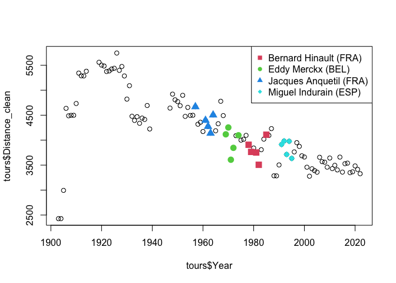

-   [1. Tour de France Legends: A Data Dive into
    Records](#tour-de-france-legends-a-data-dive-into-records)
    -   [What We Learned In The Previous
        Posts](#what-we-learned-in-the-previous-posts)
    -   [What We’re Tackling Next](#what-were-tackling-next)
-   [2. Setting The Scene](#setting-the-scene)
    -   [2.1 Installing / Loading Your
        Packages](#installing-loading-your-packages)
    -   [2.2 Loading The Data](#loading-the-data)
    -   [2.3 Cleaning The Data](#cleaning-the-data)
-   [3. Tour de France Trivia](#tour-de-france-trivia)
    -   [3.1 How Many Riders Won the Tour de France Without Winning Any
        Stage *That
        Year*?](#how-many-riders-won-the-tour-de-france-without-winning-any-stage-that-year)
    -   [3.2 Of the Riders Who Have Won the Most Tour de France, Who
        Rode the Most
        Kilometres?](#of-the-riders-who-have-won-the-most-tour-de-france-who-rode-the-most-kilometres)
-   [4. Food for thought](#food-for-thought)
-   [5. What’s Next?](#whats-next)

------------------------------------------------------------------------

This blog, along with all the necessary data, is available in different
formats (PDF, HTML, Rmd, and MD) on [DataSharp’s
GitHub](https://github.com/DataSharpAcademy/blog/tree/fcf7678f97f14e659db566519b724642126141a7/2025_07_30_Tour-de-France-3).

------------------------------------------------------------------------

## 1. Tour de France Legends: A Data Dive into Records

Our Tour de France blog series returns for a third and final episode, in
which we will learn how to combine tables, manipulate strings, and
capitalise on all acquired knowledge to uncover new Tour de France
trivia facts.

While this post can be read on its own, many juicy details are fully
detailed in our
[first](https://datasharpacademy.com/tour-de-france-meets-data-science-a-beginners-case-study/)
and
[second](https://datasharpacademy.com/tour-de-france-meets-data-science-manipulating-strings/)
posts using Tour de France data. We recommend checking these first.

Today, we’re taking things further.

### What We Learned In The Previous Posts

In our explorations of Tour de France trivia facts, we learned about a
few practical coding techniques that we will practice here.

-   **Cleaning datasets** to extract usable numbers from messy strings.
-   **Aggregating information** using `tapply()` to infer group
    statistics.
-   **Evaluating results mindfully** to uncover richer and more accurate
    insights.

### What We’re Tackling Next

In this final post on the Tour de France theme, we’re levelling up.

We will explore more complex questions such as:

-   How many riders won the Tour de France without winning a stage *in
    that year*?
-   Of the riders who won the most Tours, who rode the most kilometres?

These questions will stretch our data skills further, as we will:

❶ Combine information across multiple columns and tables.

❷ Further practice data cleaning to prepare our data for robust
analysis.

Ready? Let’s dive in.

## 2. Setting The Scene

### 2.1 Installing / Loading Your Packages

As we saw in previous posts, R’s default base package contains numerous
functionalities. However, it is common to need additional
functionalities that can be loaded with packages. This analysis is no
different. Today, we will use three packages: `readr`, `stringr`, and
`stringi`.

Installing packages in R is straightforward:

    if(!require('readr')) install.packages('readr')
    if(!require('stringr')) install.packages('stringr')
    if(!require('stringi')) install.packages('stringi')

Loading packages is commonly done with the `library(package_name)`
function, specifying the package name. However, it only works if the
package is already installed on your machine. The code above is slightly
longer, but it attempts to load the package using `require()`. If the
package is not found, it will first attempt to install it.

### 2.2 Loading The Data

If you’ve been following along, you’re already familiar with the
structure of our Tour de France dataset and how to load it into R. If
not, check out the previous posts for a step-by-step walkthrough.

For this analysis, we will once again load our three tables:

    finishers <- read.csv('./data/tdf_finishers.csv')
    stages <- read.csv('./data/tdf_stages.csv')
    tours <- readr::read_csv('./data/tdf_tours.csv', locale=readr::locale(encoding="UTF-8"))

    ## Rows: 109 Columns: 6
    ## ── Column specification ────────────────────────────────────────────────────────────────────────────
    ## Delimiter: ","
    ## chr (3): Dates, Stages, Distance
    ## dbl (3): Year, Starters, Finishers
    ## 
    ## ℹ Use `spec()` to retrieve the full column specification for this data.
    ## ℹ Specify the column types or set `show_col_types = FALSE` to quiet this message.

### 2.3 Cleaning The Data

We also identified specific issues with the riders’ names in the table.
We fixed them as follows. Check [our previous
post](https://datasharpacademy.com/tour-de-france-meets-data-science-manipulating-strings/)
for a detailed explanation of these concepts.

    finishers$Rider <- stringi::stri_trans_general(finishers$Rider, "latin-ascii")
    stages$Winner <- stringi::stri_trans_general(stages$Winner, "latin-ascii")
    finishers[finishers$Rider == "Chris Froome (UK)", 'Rider'] <- "Chris Froome (GBR)"
    stages[stages$Winner == 'Maurice Dewaele (BEL)', 'Winner'] <- 'Maurice De Waele (BEL)'

## 3. Tour de France Trivia

### 3.1 How Many Riders Won the Tour de France Without Winning Any Stage *That Year*?

This question is similar to a question we explored in [the first
post](https://datasharpacademy.com/tour-de-france-meets-data-science-a-beginners-case-study/)
(*How Many Riders Won the Tour de France Without Ever Winning a
Stage?*), adding a new twist: **Did the winner also win a stage during
that specific Tour?** Our previous analysese could only detect the Tour
winners who never won a stage, but not those who won a stage one year
and their Tour another.

It’s a subtle but important distinction that requires us to check, **for
each edition**, whether the overall winner claimed any stage victories
that year.

> **Why does this matter?** In real-world analysis, refining your
> question often changes your approach entirely. Here, we move from a
> simple list comparison to a task that requires **merging datasets** to
> align detailed records across tables. That’s why understanding and
> framing the problem should always come before coding.

#### Theoretical Detour: Merging Datasets

To address this question, we’ll merge our `finishers` and `stages`
tables using `Year` as the key:

-   `finishers` contains one row per rider per Tour (with their final
    rank).
-   `stages` contains one row per stage per Tour (with the stage
    winner).

Since both share `Year`, we can merge them using `merge()`. In our case,
since the `Year` columns in both tables have the exact same set of
values, we can perform a simple join without overthinking it. However,
if this weren’t the case, we would need to decide between:

-   `left_join` (keep all rows from the left table),
-   `right_join` (keep all rows from the right table),
-   `inner_join` (keep only rows present in both),
-   and a few other options.

I won’t cover these advanced joins here, but stay tuned for a future
post where we’ll tackle them in a clear and practical way. In our case,
all these joins would produce the same result.

#### Step 1: Merging Tables

Merged datasets can become *very large*. It is always wise to consider
whether you can **filter your tables before merging**. In our case, we
don’t need the entire `finishers` table but only the rows corresponding
to the winners of each edition.

We thus create a `finishers_onlywinners` table containing only the
riders who finished **ranked 1** in each Tour de France:

    finishers_onlywinners <- finishers[finishers$Rank ==1, ]
    stage_finish <- merge(stages, finishers_onlywinners, by='Year')
    tail(stage_finish, n=10)

    ##      Year       Date Stage                                           Course
    ## 2227 2022 2022-07-14    12                          Briançon to Alpe d'Huez
    ## 2228 2022 2022-07-15    13               Le Bourg-d'Oisans to Saint-Étienne
    ## 2229 2022 2022-07-16    14                           Saint-Étienne to Mende
    ## 2230 2022 2022-07-17    15                             Rodez to Carcassonne
    ## 2231 2022 2022-07-19    16                              Carcassonne to Foix
    ## 2232 2022 2022-07-20    17                      Saint-Gaudens to Peyragudes
    ## 2233 2022 2022-07-21    18                              Lourdes to Hautacam
    ## 2234 2022 2022-07-22    19                      Castelnau-Magnoac to Cahors
    ## 2235 2022 2022-07-23    20                  Lacapelle-Marival to Rocamadour
    ## 2236 2022 2022-07-24    21 Paris La Défense Arena to Paris (Champs-Élysées)
    ##                 Distance                  Type                   Winner Rank
    ## 2227 165.5 km (102.8 mi)        Mountain stage        Tom Pidcock (GBR)    1
    ## 2228     193 km (120 mi)            Flat stage      Mads Pedersen (DEN)    1
    ## 2229 192.5 km (119.6 mi) Medium-mountain stage   Michael Matthews (AUS)    1
    ## 2230 202.5 km (125.8 mi)            Flat stage   Jasper Philipsen (BEL)    1
    ## 2231 178.5 km (110.9 mi)        Mountain stage         Hugo Houle (CAN)    1
    ## 2232      130 km (81 mi)        Mountain stage      Tadej Pogacar (SLO)    1
    ## 2233  143.5 km (89.2 mi)        Mountain stage   Jonas Vingegaard (DEN)    1
    ## 2234 188.5 km (117.1 mi)            Flat stage Christophe Laporte (FRA)    1
    ## 2235   40.7 km (25.3 mi) Individual time trial      Wout van Aert (BEL)    1
    ## 2236      116 km (72 mi)            Flat stage   Jasper Philipsen (BEL)    1
    ##                       Rider        Time             Team
    ## 2227 Jonas Vingegaard (DEN) 79h 33' 20" Team Jumbo–Visma
    ## 2228 Jonas Vingegaard (DEN) 79h 33' 20" Team Jumbo–Visma
    ## 2229 Jonas Vingegaard (DEN) 79h 33' 20" Team Jumbo–Visma
    ## 2230 Jonas Vingegaard (DEN) 79h 33' 20" Team Jumbo–Visma
    ## 2231 Jonas Vingegaard (DEN) 79h 33' 20" Team Jumbo–Visma
    ## 2232 Jonas Vingegaard (DEN) 79h 33' 20" Team Jumbo–Visma
    ## 2233 Jonas Vingegaard (DEN) 79h 33' 20" Team Jumbo–Visma
    ## 2234 Jonas Vingegaard (DEN) 79h 33' 20" Team Jumbo–Visma
    ## 2235 Jonas Vingegaard (DEN) 79h 33' 20" Team Jumbo–Visma
    ## 2236 Jonas Vingegaard (DEN) 79h 33' 20" Team Jumbo–Visma

    dim(stage_finish)

    ## [1] 2236   11

Since there are many stages in each Tour de France, the `stages` table
contained multiple rows per year, while `finishers_onlywinners` had only
**one row per year**. During the merge, the information from
`finishers_onlywinners` was duplicated as many times as necessary to
align with each corresponding stage in `stages`.

Thanks to this merge, **each row now displays both the stage winner and
the corresponding Tour de France winner for that year**. Now, to address
our question, we need to identify all the editions where there is no
match between these two columns.

#### Step 2: Identify If The Winner Won A Stage

With the merge, we were able to align Tour winners with stage winners.
If we directly compare these two columns, we will obtain a boolean
vector that tells us whether the two names on each line are identical:

    stage_finish$stage_and_tour <- stage_finish$Rider == stage_finish$Winner
    head(stage_finish)

    ##   Year       Date Stage                Course        Distance
    ## 1 1903 1903-07-08     3 Marseille to Toulouse 423 km (263 mi)
    ## 2 1903 1903-07-12     4  Toulouse to Bordeaux 268 km (167 mi)
    ## 3 1903 1903-07-13     5    Bordeaux to Nantes 425 km (264 mi)
    ## 4 1903 1903-07-01     1         Paris to Lyon 467 km (290 mi)
    ## 5 1903 1903-07-05     2     Lyon to Marseille 374 km (232 mi)
    ## 6 1903 1903-07-18     6       Nantes to Paris 471 km (293 mi)
    ##                     Type                      Winner Rank               Rider
    ## 1            Plain stage Hippolyte Aucouturier (FRA)    1 Maurice Garin (FRA)
    ## 2            Plain stage        Charles Laeser (SUI)    1 Maurice Garin (FRA)
    ## 3            Plain stage         Maurice Garin (FRA)    1 Maurice Garin (FRA)
    ## 4            Plain stage         Maurice Garin (FRA)    1 Maurice Garin (FRA)
    ## 5 Stage with mountain(s) Hippolyte Aucouturier (FRA)    1 Maurice Garin (FRA)
    ## 6            Plain stage         Maurice Garin (FRA)    1 Maurice Garin (FRA)
    ##          Time         Team stage_and_tour
    ## 1 94h 33' 14" La Française          FALSE
    ## 2 94h 33' 14" La Française          FALSE
    ## 3 94h 33' 14" La Française           TRUE
    ## 4 94h 33' 14" La Française           TRUE
    ## 5 94h 33' 14" La Française          FALSE
    ## 6 94h 33' 14" La Française           TRUE

We can see that the new column contains TRUE when Maurice Garin, who won
the first 1903 Tour de France, also won a stage that year, and FALSE
when he didn’t.

Our objective has thus now become: Can we find at least one TRUE in that
column for each specific year?

> As explained in the [last Tour de France
> post](https://datasharpacademy.com/tour-de-france-meets-data-science-manipulating-strings/),
> this type of problem calls for `tapply()`.

In this case, however, we will not use an existing function, but we will
provide our own.

We are focused on identifying the years when the winner did not win any
stage, *i.e.* identifying the year when the `stage_and_tour` column only
contains FALSE values.

There are several ways to test that, but we will take advantage of one
property of the boolean FALSE, which is also equal to 0 in R. Only FALSE
values thus mean that the sum of the vector is 0 (0 + 0 + 0 + 0 + 0 ..).
We will hence test for which years the sum of all boolean values from
`stage_and_tour` is equal to 0.

TRUE means that the Tour winner did not win any stage (sum = 0), while
FALSE means that he won at least one stage.

    tour_but_no_stage <- tapply(stage_finish$stage_and_tour, stage_finish$Year, function(x) return(sum(x) == 0))
    ## Since tour_but_no_stage is a boolean vector, I can use it to subset itself
    ## to get the years when the overall winner did not win a single stage
    tour_but_no_stage[tour_but_no_stage]

    ## 1904 1922 1956 1960 1966 1990 2006 2017 2019 
    ## TRUE TRUE TRUE TRUE TRUE TRUE TRUE TRUE TRUE

> 🚴‍♂️ We can conclude that **9 Tour de France winners won the overall
> Tour without winning a single stage in the year they won.**

#### Bonus Step: Can We Identify The Name of These 9 Riders?

Since we identified the years when these peculiar wins occurred, we can
subset one of our tables that contains both `Year` and `Rider`
(`finishers_onlywinner` or `stage_finish`).

    tour_but_no_stage <- names(tour_but_no_stage[tour_but_no_stage])
    tour_but_no_stage

    ## [1] "1904" "1922" "1956" "1960" "1966" "1990" "2006" "2017" "2019"

    winners_no_stage <- unique(stage_finish[stage_finish$Year %in% tour_but_no_stage, c('Year', "Rider")])
    winners_no_stage

    ##      Year                 Rider
    ## 7    1904    Henri Cornet (FRA)
    ## 199  1922   Firmin Lambot (BEL)
    ## 804  1956 Roger Walkowiak (FRA)
    ## 897  1960 Gastone Nencini (ITA)
    ## 1037 1966    Lucien Aimar (FRA)
    ## 1641 1990     Greg LeMond (USA)
    ## 1880 2006   Oscar Pereiro (ESP)
    ## 2111 2017    Chris Froome (GBR)
    ## 2153 2019     Egan Bernal (COL)

The final step consists of checking that no typos persist in the Tour or
stage winner names. Since we do not have many names to check, we can do
it manually.

In this list of 9 winners, we recognised the names of the three riders
we previously identified as Tour winners without ever winning stages
(Henri Cornet, Roger Walkowiak, and Egan Bernal). We can therefore
visually inspect our data for the remaining six riders:

    for(y in 1:nrow(winners_no_stage)) {
        if(! winners_no_stage[y, 'Rider'] %in% c("Henri Cornet (FRA)", 'Roger Walkowiak (FRA)', 'Egan Bernal (COL)')){
            print(paste("Winner name", winners_no_stage[y, 'Rider'], sep=": "))
            print(unique(stage_finish[stage_finish$Year == winners_no_stage[y, 'Year'], ]$Winner))
            print(noquote(""))
        }
    }

    ## [1] "Winner name: Firmin Lambot (BEL)"
    ## [1] "Philippe Thys (BEL)"    "Romain Bellenger (FRA)" "Robert Jacquinot (FRA)"
    ## [4] "Jean Alavoine (FRA)"    "Federico Gay (ITA)"     "Felix Sellier (BEL)"   
    ## [7] "Emile Masson (BEL)}"    "Emile Masson (BEL)"    
    ## [1] 
    ## [1] "Winner name: Gastone Nencini (ITA)"
    ##  [1] "Jean Graczyk (FRA)"         "Julien Schepens (BEL)"     
    ##  [3] "Roger Riviere (FRA)"        "Rene Privat (FRA)"         
    ##  [5] "Nino Defilippis (ITA)"      "Andre Darrigade (FRA)"     
    ##  [7] "Graziano Battistini (ITA)"  "Martin van Geneugden (BEL)"
    ##  [9] "Kurt Gimmi (SUI)"           "Michel Van Aerde (BEL)"    
    ## [11] "Louis Proost (BEL)"         "Fernando Manzaneque (ESP)" 
    ## [13] "Rolf Graf (SUI)"            "Pierre Beuffeuil (FRA)"    
    ## [1] 
    ## [1] "Winner name: Lucien Aimar (FRA)"
    ##  [1] "Edy Schutz (LUX)"              "Ferdinand Bracke (BEL)"       
    ##  [3] "Franco Bitossi (ITA)"          "Rudi Altig (FRG)"             
    ##  [5] "Guido Reybrouck (BEL)"         "Televizier-Batavus"           
    ##  [7] "Gerben Karstens (NED)"         "Willy Planckaert (BEL)"       
    ##  [9] "Edward Sels (BEL)"             "Henk Nijdam (NED)"            
    ## [11] "Pierre Beuffeuil (FRA)"        "Guido Marcello Mugnaini (ITA)"
    ## [13] "Georges Vandenberghe (BEL)"    "Jo de Roo (NED)"              
    ## [15] "Raymond Poulidor (FRA)"        "Luis Otano (ESP)"             
    ## [17] "Julio Jimenez (ESP)"           "Tommaso de Pra (ITA)"         
    ## [19] "Albert Van Vlierberghe (BEL)" 
    ## [1] 
    ## [1] "Winner name: Greg LeMond (USA)"
    ##  [1] "Massimo Ghirotto (ITA)"    "Johan Museeuw (BEL)"      
    ##  [3] "Olaf Ludwig (GDR)"         "Thierry Marie (FRA)"      
    ##  [5] "Frans Maassen (NED)"       "Panasonic-Sportlife"      
    ##  [7] "Moreno Argentin (ITA)"     "Gerrit Solleveld (NED)"   
    ##  [9] "Jelle Nijdam (NED)"        "Raul Alcala (MEX)"        
    ## [11] "Erik Breukink (NED)"       "Eduardo Chozas (ESP)"     
    ## [13] "Thierry Claveyrolat (FRA)" "Gianni Bugno (ITA)"       
    ## [15] "Miguel Indurain (ESP)"     "Dimitri Konychev (URS)"   
    ## [17] "Marino Lejarreta (ESP)"    "Charly Mottet (FRA)"      
    ## [19] "Guido Bontempi (ITA)"     
    ## [1] 
    ## [1] "Winner name: Oscar Pereiro (ESP)"
    ##  [1] "Thor Hushovd (NOR)"        "Jimmy Casper (FRA)"       
    ##  [3] "Robbie McEwen (AUS)"       "Matthias Kessler (GER)"   
    ##  [5] "Oscar Freire (ESP)"        "Serhiy Honchar (UKR)"     
    ##  [7] "Sylvain Calzati (FRA)"     "Juan Miguel Mercado (ESP)"
    ##  [9] "Denis Menchov (RUS)"       "Yaroslav Popovych (UKR)"  
    ## [11] "Jens Voigt (GER)"          "Pierrick Fedrigo (FRA)"   
    ## [13] "Frank Schleck (LUX)"       "Michael Rasmussen (DEN)"  
    ## [15] "Carlos Sastre (ESP)"       "Matteo Tosatto (ITA)"     
    ## [1] 
    ## [1] "Winner name: Chris Froome (GBR)"
    ##  [1] "Geraint Thomas (GBR)"       "Marcel Kittel (GER)"       
    ##  [3] "Peter Sagan (SVK)"          "Arnaud Demare (FRA)"       
    ##  [5] "Fabio Aru (ITA)"            "Lilian Calmejane (FRA)"    
    ##  [7] "Rigoberto Uran (COL)"       "Romain Bardet (FRA)"       
    ##  [9] "Warren Barguil (FRA)"       "Michael Matthews (AUS)"    
    ## [11] "Bauke Mollema (NED)"        "Primoz Roglic (SLO)"       
    ## [13] "Edvald Boasson Hagen (NOR)" "Maciej Bodnar (POL)"       
    ## [15] "Dylan Groenewegen (NED)"   
    ## [1]

These six riders conclusively did not win any stage in the year of their
win.

📝 **Note**: There are prettier ways to do such checks. However, we used
quick and dirty code to demonstrate that it is not always necessary to
seek a pretty solution, especially when performing internal checks. If
you’re asked for some insights from datasets, nobody will care how you
arrived at them. The results you found and the confidence you have in
them are what matters. So when in doubt, write a quick and dirty check
to ensure the data supports your results. A few manual checks are
perfectly fine.

### 3.2 Of the Riders Who Have Won the Most Tour de France, Who Rode the Most Kilometres?

A handful of cyclists share the record for the most Tour de France wins.
But among them, who had to ride the most kilometres to achieve those
victories?

Let’s say the record was 8 wins (it’s not — but imagine it was). We’d
like to know which rider covered the most kilometres *across their
winning editions*. That’s our challenge.

To tackle this, we can break the problem into manageable parts:

1.  Identify the current maximum number of wins.
2.  Retrieve the list of riders with that number of wins.
3.  Extract the distance of each Tour de France from the `tours` table.
4.  Sum the distances for each winning rider.

#### Step 1: Find the Max Number of Tour Wins

We start by identifying how many times the most decorated riders have
won the Tour.

We first subset the `finishers` table to those riders who ranked first.
Then we count how many times each name appears in the list of winners,
and we conclude by extracting the names of those who won the most.

    max_wins <- max(table(finishers[finishers$Rank ==1, "Rider"]))
    paste("The maximum number of Tour victories is", max_wins)

    ## [1] "The maximum number of Tour victories is 5"

    max_winners <- table(finishers[finishers$Rank == 1, "Rider"])
    max_winners <- max_winners[max_winners == max_wins]
    names(max_winners)

    ## [1] "Bernard Hinault (FRA)"  "Eddy Merckx (BEL)"      "Jacques Anquetil (FRA)"
    ## [4] "Miguel Indurain (ESP)"

➡️ 4 riders share the record for most Tour de France wins (5). But who
among them had to ride the most kilometres?

#### Step 2: Clean the Distance Column

The `tours` table contains the total distance for each edition, but the
formatting isn’t quite ready for analysis.

Let’s peek at the data:

    head(tours)

    ## # A tibble: 6 × 6
    ##    Year Dates                        Stages Distance          Starters Finishers
    ##   <dbl> <chr>                        <chr>  <chr>                <dbl>     <dbl>
    ## 1  1903 "1\x9619 July 1903"          6      "2,428\xa0km (1,…       60        21
    ## 2  1904 "2\x9624 July 1904"          6      "2,428\xa0km (1,…       88        15
    ## 3  1905 "9\x9630 July 1905"          11     "2,994\xa0km (1,…       60        24
    ## 4  1906 "4\x9629 July 1906"          13     "4,637\xa0km (2,…       82        14
    ## 5  1907 "8 July \x96 4 August 1907"  14     "4,488\xa0km (2,…       93        33
    ## 6  1908 "13 July \x96 9 August 1908" 14     "4,497\xa0km (2,…      112        36

You’ll notice unusual characters in the `Distance` column. We’ve seen
this
[before](https://datasharpacademy.com/tour-de-france-meets-data-science-manipulating-strings/).
It’s time to standardise data again.

    tours$Distance <- stringi::stri_trans_general(tours$Distance, "latin-ascii")
    head(tours)

    ## # A tibble: 6 × 6
    ##    Year Dates                        Stages Distance          Starters Finishers
    ##   <dbl> <chr>                        <chr>  <chr>                <dbl>     <dbl>
    ## 1  1903 "1\x9619 July 1903"          6      2,428�km (1,509�…       60        21
    ## 2  1904 "2\x9624 July 1904"          6      2,428�km (1,509�…       88        15
    ## 3  1905 "9\x9630 July 1905"          11     2,994�km (1,860�…       60        24
    ## 4  1906 "4\x9629 July 1906"          13     4,637�km (2,881�…       82        14
    ## 5  1907 "8 July \x96 4 August 1907"  14     4,488�km (2,789�…       93        33
    ## 6  1908 "13 July \x96 9 August 1908" 14     4,497�km (2,794�…      112        36

The `Distance` column contains entries like `"3,414.4 km (1,121.6 mi)"`.
We want to extract only the first number (in km).

We can thus split the distance by a shared pattern among all the
distances, which is ” km”. However, that space-like character is not
really a space.

At this point, I am not sure which ASCII character
`stringi::stri_trans_general()` chose to replace the non-ASCII one. But
it doesn’t matter.

We do not need to know what it is to use it.

All we need to do is use one of the distance strings as a template for
that pattern by cutting it where necessary. Let’s use the distance of
the Tour 2022, which does not contain a decimal value.

    tours$Distance[109]

    ## [1] "3,328�km (2,068�mi)"

    str_pattern <- substr(tours$Distance[109], 6, 8)
    str_pattern

    ## [1] "�km"

We cut the string betweeen the 6th and 8th positions, which correspond
to the pattern we seek.

We can then inject this pattern in `stringr::str_split()` to extract the
distance in km.

    tours$Distance_clean <- stringr::str_split(tours$Distance, str_pattern, simplify=TRUE)[, 1]
    tail(tours$Distance_clean)

    ## [1] "3,540"   "3,349"   "3,366"   "3,484"   "3,414.4" "3,328"

We’re almost there!

You can see that the `Distance_clean` field is still a character. We
need to remove the commas and force the strings to numerical values.

    tours$Distance_clean <- as.numeric(stringr::str_replace(tours$Distance_clean, ",", ""))
    tail(tours$Distance_clean)

    ## [1] 3540.0 3349.0 3366.0 3484.0 3414.4 3328.0

#### Step 3: Merge datasets

Then, we only have to merge the `tours` and `stage_finish` tables, the
latter being restricted to the 4 riders who won 5 Tours. For reading
purposes, we also sort the table using the `order(, decreasing=TRUE)`
function to get the longest Tours at the top.

    all_dtst <- merge(stage_finish[stage_finish$Rider %in% names(max_winners), ], tours, by='Year')
    all_dtst <- unique(all_dtst[, c('Year', 'Rider', 'Distance_clean')])
    all_dtst[order(all_dtst[, 'Distance_clean'], decreasing=TRUE), ]

    ##     Year                  Rider Distance_clean
    ## 1   1957 Jacques Anquetil (FRA)           4669
    ## 94  1964 Jacques Anquetil (FRA)           4504
    ## 25  1961 Jacques Anquetil (FRA)           4397
    ## 47  1962 Jacques Anquetil (FRA)           4274
    ## 145 1970      Eddy Merckx (BEL)           4254
    ## 71  1963 Jacques Anquetil (FRA)           4138
    ## 119 1969      Eddy Merckx (BEL)           4117
    ## 349 1985  Bernard Hinault (FRA)           4109
    ## 224 1974      Eddy Merckx (BEL)           4098
    ## 396 1992  Miguel Indurain (ESP)           3983
    ## 439 1994  Miguel Indurain (ESP)           3978
    ## 373 1991  Miguel Indurain (ESP)           3914
    ## 251 1978  Bernard Hinault (FRA)           3908
    ## 199 1972      Eddy Merckx (BEL)           3846
    ## 276 1979  Bernard Hinault (FRA)           3765
    ## 301 1981  Bernard Hinault (FRA)           3753
    ## 418 1993  Miguel Indurain (ESP)           3714
    ## 461 1995  Miguel Indurain (ESP)           3635
    ## 174 1971      Eddy Merckx (BEL)           3608
    ## 326 1982  Bernard Hinault (FRA)           3507

Of the four Tour winners with the most victories, Jacques Anquetil,
known as Maître Jacques, has won the longest. If we look beyond the
first place, we also notice that he actually won 5 of the 6 longest
Tours listed here. This is not surprising for those familiar with
cycling, as there has been a decreasing trend over the past 100 years.

We can make a simple plot to illustrate this trend:

    plot(tours$Year, tours$Distance_clean)
    i=2
    for(rider in names(max_winners)) {
        points(all_dtst[all_dtst$Rider == rider,
               c('Year', 'Distance_clean')],
               col=i, pch=i+13, cex=1.5)
        i <- i+1
    }
    legend("topright", col=2:5, pch=15:18, names(max_winners))

**Note**: The `i` variable used in the for loop is only here to select
colours and symbols. The loop variable is `rider`.

#### Step 4: Calculate the total distance across all wins

Finally, we can calculate the total distance associated with the 5
winning Tours of each of these champions, using the `tapply()` function
we discovered in [the previous blog
post](https://datasharpacademy.com/tour-de-france-meets-data-science-manipulating-strings/).

    sort(tapply(all_dtst$Distance_clean, all_dtst$Rider, sum))

    ##  Bernard Hinault (FRA)  Miguel Indurain (ESP)      Eddy Merckx (BEL) 
    ##                  19042                  19224                  19923 
    ## Jacques Anquetil (FRA) 
    ##                  21982

Maitre Jacques rode almost 22,000 km to win his five Tours, while
Bernard Hinault rode “only” 19,000 km.

## 4. Food for thought

1.  **R base is more powerful than it looks.** With a bit of care, basic
    functions like `substr()`, `tapply()`, and `which.min()` can take
    you surprisingly far, even with messy data and vague questions.
2.  **Break big problems into smaller ones.** Identifying smaller tasks
    makes analysis easier. Don’t aim to “answer the question” in one go.
    List out the steps and take them one at a time.
3.  **All roads lead to Rome.** There’s no single “correct” way to solve
    a data problem. Write the code that makes sense to you. It doesn’t
    need to be fast, beautiful, or perfect. But it must be clear and
    correct.
4.  **Know what you’re doing and do it with confidence.** Take your
    time, double-check assumptions, and move forward when things make
    sense. You don’t need to rush to look competent; clarity is
    competence.

> 💛 **Key takeaway:** Good data analysis is not just about getting the
> numbers, but about understanding *why* they are correct, *how* you
> arrived at them, and *being mindful of the hidden details* in your
> data along the way.

## 5. What’s Next?

This was the last post on this Tour de France theme. We hope you enjoyed
discovering a few data analysis tricks, expanding your data scientist
mindset, and learning some handy facts for your next trial pursuit game
night with friends.

In the next blog post series, we will continue to use sports data but
combine it with the video game universe.

**HINT**: ⚽️ x 💧🔥🌱

> 👉 **Stay tuned**, and if you have questions or examples you’d like us
> to cover in the next post, drop them in the comments below!

> 📝 **Your learning challenge until then:** Can you identify the
> maximum number of stage wins for any given Tour win?

------------------------------------------------------------------------

This blog, along with all the necessary data, is available in different
formats (PDF, HTML, Rmd, and MD) on [DataSharp’s
GitHub](https://github.com/DataSharpAcademy/blog/tree/fcf7678f97f14e659db566519b724642126141a7/2025_07_30_Tour-de-France-3).

------------------------------------------------------------------------
